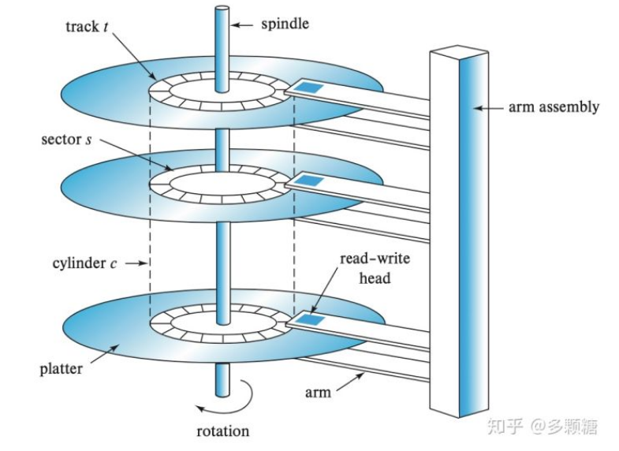
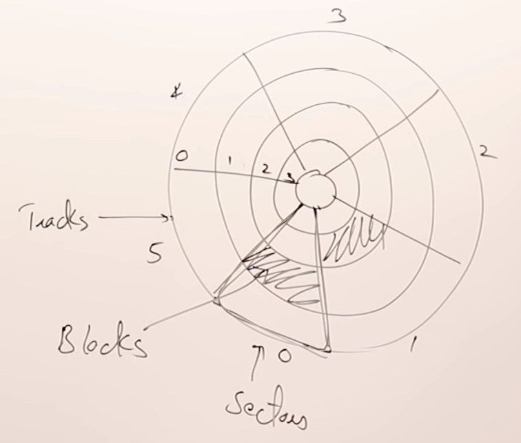
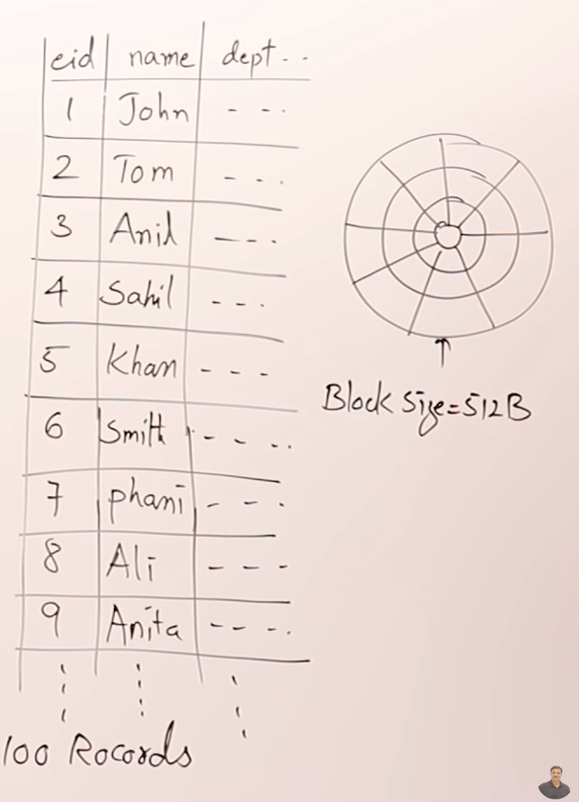
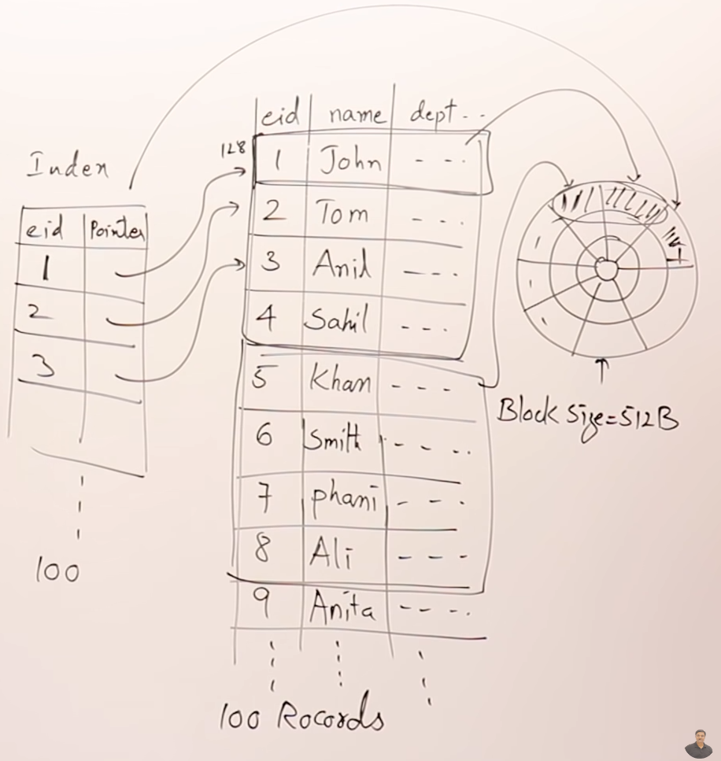
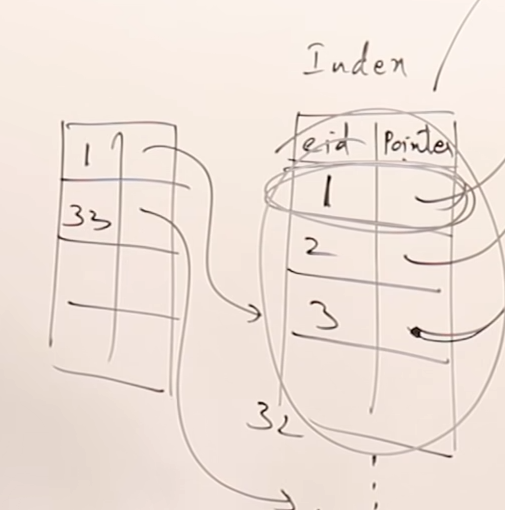

# Overview

最近面试被问到很多关于 B+Tree 原理性的问题：

- “B+Tree 为什么就适合在读多写少的场景？”

- “基于磁盘的 B+Tree 索引原理是什么？”

一直感觉自己对 B+Tree 这种索引结构还算熟悉，但是真正讲出来又发现知道的东西很空洞，而且也支撑不了自己的观点。所以在这里记录一下 DBMS 使用 B+Tree 的原理。


# Disk structure

磁盘由许多个盘面（platter）组成，每个盘面上对其进行**逻辑**上的划分：磁道（track）和扇区（sector）。我们可以对每个 track 和 sector 进行编号：1 号 track 、2 号 track ，1 号 sector 、2 号 sector 等。track 和 sector 交错形成部分，称之为块（block），用 `(track id, sector id)` 对 block 进行唯一定位（比如 block(1, 2) 代表 1 号磁道，2 号扇区的 block ）。每块 block 的大小通常为 **512bytes** （这与磁盘生产厂家有关，但普遍为这个值）。所以一个 block 的地址范围为 0~511 。






所以读取磁盘上某个 block 的某个具体字节，需要知道 **track id** 、**sector id** 、**offset** 。具体过程为：

- 通过前后移动磁臂（arm）来找到对应的 track

- 通过旋转 platter 来找到对应的 sector

- 通过 offset 找到对应 block 上的字节


磁盘不可以像内存一样直接进行操作的，需要将其读取到内存中再进行读写数据。我们一般是以文件的形式存储到磁盘上，但从磁盘中加载文件并不是一次性把整个文件加载到内存中的，而是**一次 I/O 加载一个页大小**。通常页大小为 4KB ，但现在市面上也有 8KB 等页大小。


# Data storage

假设有如下一张表，包含 100 个 record ，每个 record 占用 128bytes 。如何在磁盘存放这张表呢？



由于一个 record 占用 128bytes ，那么一个 block 就可以存放 512 / 128 = 4 record 。那这 100 个 record 就需要 25 个 block 来存放。如果想读取某个 record ，那么需要平均读取 O(N) 个 block （N: block num），在这里即 25 个 block 。如果有 100w 个 record ，就需要平均读取 25w 个 block 。


这太糟糕了！所以需要通过额外的存储来换取更高的效率——索引。我们为其加上一层索引：



假设一个索引 record 占用 16bytes ，那么索引占用了 100 * 16 = 1600bytes ，需要 1600 / 512 ~= 4 block 来存放。通过索引，我们现在最多需要访问 4 index blocks + 1 data block 。比原来的 25 足足少了 5 倍，即访问的效率大大提高。


但是还是存在一些问题：如果数据量越来越大，索引项也会越来越多，那么访问的效率就会不断下降。所以我们可以建索引的索引：二级索引可以保存每个一级索引 block 的第一条记录。所以现在访问数据最多需要 1 secondary index block + 1 primary index block + 1 data block 。这就是多级索引（multi-index）的思想。




但我们很难去决定到底要多少级索引才是好的。如果级数太多了，会占用太多内存；如果级数太少了，会影响访问效率。同时也不希望人为地管理索引。


我们希望在数据增长的时候索引能自动增加层级，在数据减少的时候自动减少层级，即我们想要**可以自我管理（self-manage）的多级索引**。B+Tree 孕育而生。


# B/B+Tree

B/B+Tree 是一种 N-ways Search Tree ，也一种可以自我管理的多级索引：在插入时，节点中的元素超过 N-1 时会进行 split ，并递归地将节点中间元素提升到上一层作为 index ；在删除时，节点中的元素少于 (N-1)/2 时会进行 merge ，并递归地回收 index 。


> 为什么 B/B+Tree 这种 N-ways Search Tree 会比 2-way Search Tree (Red Black Tree, AVL) 更适合用在磁盘？

**为了减少读写磁盘次数。**

像 AVL 、RBT 这种数据结构，一个节点只能存放一个元素，所以造成

- 逻辑上连续的元素在物理存储上不连续

- 树的高度通常比 N-ways Search Tree 高

针对第一个问题，由于**局部性原理，当访问某个数据时，其附近的数据通常也会被马上用到**。B/B+Tree 很好的通过一个节点可以存储多个连续的元素来解决，让逻辑上相邻的数据都能尽量的存储在物理上也相邻的硬盘空间上，减少磁盘读写。

针对第二个问题，由于一个节点可以存储多个元素，树的高度显然低于 2-ways Search Tree ，所以 **I/O 次数更少**。

- 为什么 I/O 次数更少？同一层的数据一般都是存储到相邻 block 的，根据刚才分析的访问数据“先访问二级索引块，再访问一级索引块，最后访问数据块”这种跳跃式访问的特点（磁盘寻道），所以树的高度越低，I/O 就越少（实际生产中一般就 4 、5 层）。


# Why B+Tree?

为什么在市面上众多开源数据库以 B+Tree 为存储引擎而不是 BTree 或 hash ？最重要的原因就是：B+Tree 对 range scan 是这三个中最友好的。

首先 B/B+Tree 的查询和插入的时间复杂度均为 **O(logN)** ，N 为数据量。


对于 hash 来说，虽然在点查、插入能提供非常诱人的 O(1) 时间复杂度，但 hash 没有办法做到 range scan ，只能通过全表扫描，时间复杂度为 O(N) 。这其实是很难接受的，因为需要 range scan 的场景非常多，如：

```SQL
SELECT * FROM posts WHERE author = 'xxx' ORDER BY created_at DESC
SELECT * FROM posts WHERE comments_count > 10
UPDATE posts SET github = 'github.com/xxx' WHERE author = 'xxx'
DELETE FROM posts WHERE author = 'xxx'
```

但这些对于 B/B+Tree 是可以做到的。


对与 B Tree 来说，确实可以做到 range scan ，但是**一次 range scan 会带来很多次随机 I/O** ：


如上图所示，如果需要查询 `> 4 && < 9` 的数据，不考虑任何优化，需要经过 4 次随机 I/O 才能做到：

- 访问根节点所在的页，发现根节点的第一个元素是 6，大于 4；

- 通过根节点的指针加载左子节点所在的页，遍历页面中的数据，找到 5；

- 重新加载根节点所在的页，发现根节点不包含第二个元素；

- 通过根节点的指针加载右子节点所在的页，遍历页面中的数据，找到 7 和 8；


在 B+Tree 中就不存在上面两种问题了：**B+Tree 的所有元素都会存在于叶子节点中，并用双向链表的形式连接每一个相邻的叶子节点**。需要 range scan 时无需走上层索引，直接遍历底层链表就可以实现。


# B+Tree Write/Read/Space Amplification

参数定义

- N: 总记录数

- B: 一个数据块上能存储的记录数


> 写放大 = 实际写入大小 / 数据本身大小

对于每一次写来说，节点分裂的概率为 1/B ，所以概率很小可以忽略。磁盘写入的单位为块，当写一条数据的时候，需要重写整个 block ，所以写放大为 **B** 。


> 读放大 = I/O 次数

- 如果未缓存中间节点，读放大为 B+Tree 的深度，即为 **O(log(B)N/B)**

- 如果缓存了中间节点，读放大仅为 **1** ，因为只需读取一次叶子节点


> 空间放大 = 实际占用大小 / 数据本身大小

B+Tree 中节点满了之后继续写会发生写分裂，分裂之后的节点**填充率为 1/2** 。假设 B+Tree 中节点的填充率在 1/2 到 1 之间是均匀分布的，因而得出平均填充率 3/4 。因而空间放大因子是 **4/3** ，约为 1.3 。


# Reference

- https://draveness.me/whys-the-design-mysql-b-plus-tree/

- https://www.codedump.info/post/20200609-btree-1/

- https://www.youtube.com/watch?v=aZjYr87r1b8

- https://zxylvlp.github.io/blog/blsm.html